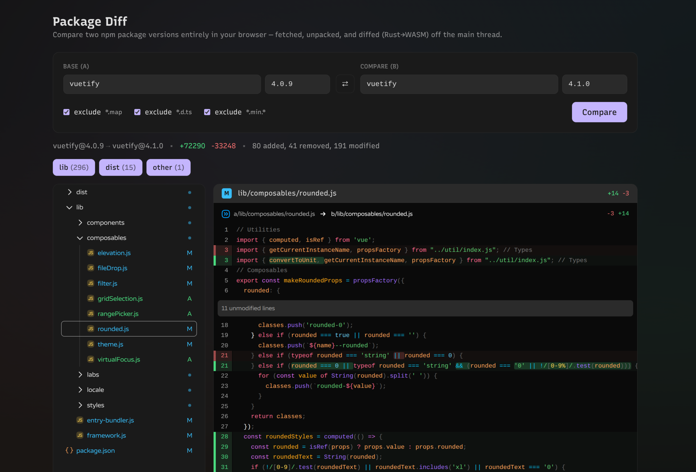

# pkg-diff

Diff two npm package versions **entirely in the browser**. Built as a static site
(no server, no backend) on top of [Vuetify0](https://0.vuetifyjs.com/).

**[Try it live → pkg-diff.netlify.app](https://pkg-diff.netlify.app/)**



The original manual workflow this replaces:

```bash
# download + extract two tarballs, then:
diff -r --exclude="*.map" --exclude="*.d.ts" \
  ./vuetify-4.1.0/package/lib \
  ./@vuetify__nightly-4.1.0-master.../package/lib
```

…now happens with two inputs and a button. The default comparison is the user's
real use-case: `vuetify@latest` vs `@vuetify/nightly@latest`.

## How it works

Everything heavy runs in a **Web Worker** so the main thread stays responsive:

1. **Resolve** — fetch the packument from `registry.npmjs.org` (sends
   `Access-Control-Allow-Origin: *`, so no proxy needed) and turn a version or
   dist-tag like `latest` into a concrete tarball URL.
2. **Download + cache** — fetch the `.tgz`, storing bytes in the **Cache Storage
   API** keyed by URL. Version tarballs are immutable, so cache hits are free and
   never stale.
3. **Extract** — gunzip with the native `DecompressionStream('gzip')` (no WASM
   needed for this), then a small dependency-free tar parser handles ustar,
   `prefix` long names, PAX (`x`) and GNU (`L`) headers. The leading `package/`
   directory npm wraps everything in is stripped.
4. **Diff** — file trees are compared for added / removed / modified. Modified
   text files are line-diffed by a **Rust → WASM** module (the `similar` crate)
   that produces a unified diff; binary files are detected and skipped.
5. **Render** — a scope filter (`lib` / `dist` / `other`), a virtualized file
   tree sidebar ([`@pierre/trees`](https://diffs.com)) with A/M/D status, and a
   diff content pane ([`@pierre/diffs`](https://diffs.com)).

### Diff rendering (Pierre)

The sidebar uses `@pierre/trees` and the content pane uses `@pierre/diffs` — both
via their **framework-agnostic vanilla cores** (no React), wrapped in thin Vue
components (`PierreTree.vue`, `PierreFileDiff.vue`) that render into a container
element and clean up on unmount.

Crucially, `@pierre/diffs` renders **from a unified patch**, not the full file:
we prepend `---`/`+++` headers to the WASM patch and hand it to `processFile()`,
so a multi-MB minified `dist` file with a small change is still a tiny render.
It also virtualizes long diffs. Highlighting is **off** (`forcePlainText`, i.e. no
Shiki highlighter is loaded) — Pierre keeps its gutters/line-numbers/±backgrounds
but downloads no language grammars. Theming maps `--v0-*` → Pierre's
`--diffs-*-override` / `--trees-theme-*` custom properties.

> Note: importing `@pierre/diffs` statically bundles Shiki, so `dist/` emits many
> lazy per-language grammar chunks. They are never fetched at runtime in
> plain-text mode, but they do inflate the build output.

### Layout

```
wasm/                      Rust crate → public/diff.wasm (C-ABI, no wasm-bindgen)
public/diff.wasm           prebuilt module, served statically
src/lib/
  registry.ts              npm packument resolution + version listing
  fetch-tarball.ts         Cache-Storage-backed tarball fetch
  tar.ts                   DecompressionStream gunzip + tar parser
  wasm-diff.ts             loads diff.wasm, marshals strings in/out of memory
  diff-engine.ts           tree diff orchestration (pure, runs in worker)
  types.ts                 shared, structured-clone-safe types
src/worker/diff.worker.ts  the pipeline, off the main thread
src/composables/useDiff.ts main-thread reactive handle for the worker
src/components/            DiffApp (Vuetify0 + UnoCSS) + PierreTree / PierreFileDiff wrappers
scripts/verify.mjs         Node end-to-end check against real npm packages
```

## URL parameters

The two packages being compared are read from (and written back to) the query
string, so any comparison is a shareable, bookmarkable link.

| Param | Meaning | Default |
|-------|---------|---------|
| `a`   | Base package name (left side) | `vuetify` |
| `b`   | Compare package name (right side) | `@vuetify/nightly` |
| `av`  | Base version or dist-tag (optional) | `latest` |
| `bv`  | Compare version or dist-tag (optional) | `latest` |

- Read once on load; missing params fall back to the defaults above.
- After you hit **Compare**, the URL is rewritten (via `history.replaceState`, so
  no new history entry) to reflect the current selection. `av`/`bv` are omitted
  when they are `latest` to keep links clean.
- Versions may be any published version (`4.1.0`) or a dist-tag (`latest`,
  `next`, …); the value is passed straight to the npm registry resolver.

```text
# vue 3.5.0  vs  vue 3.5.13
?a=vue&av=3.5.0&b=vue&bv=3.5.13

# latest vuetify  vs  the nightly channel (same as no params)
?a=vuetify&b=@vuetify/nightly
```

Scoped names work as-is — `@scope/pkg` needs no encoding in the query string.

## Develop

```bash
pnpm install
pnpm dev
```

## Build (static site)

```bash
pnpm build:wasm   # only needed when wasm/ changes — output is committed
pnpm build        # type-check + vite build → dist/ (deploy anywhere static)
pnpm preview      # serve dist/ locally
```

`dist/` is a fully static bundle: `index.html`, hashed JS/CSS, the worker chunk,
and `diff.wasm` (served with `application/wasm`). Drop it on any static host.

### Rebuilding the WASM module

Requires the Rust toolchain and the wasm target:

```bash
rustup target add wasm32-unknown-unknown
pnpm build:wasm
```

## Verify the pipeline

Runs the real fetch → gunzip → untar → WASM-diff path in Node against live npm:

```bash
node scripts/verify.mjs                           # vuetify vs @vuetify/nightly
node scripts/verify.mjs vue 3.5.0 vue 3.5.13      # any two name@version pairs
```
